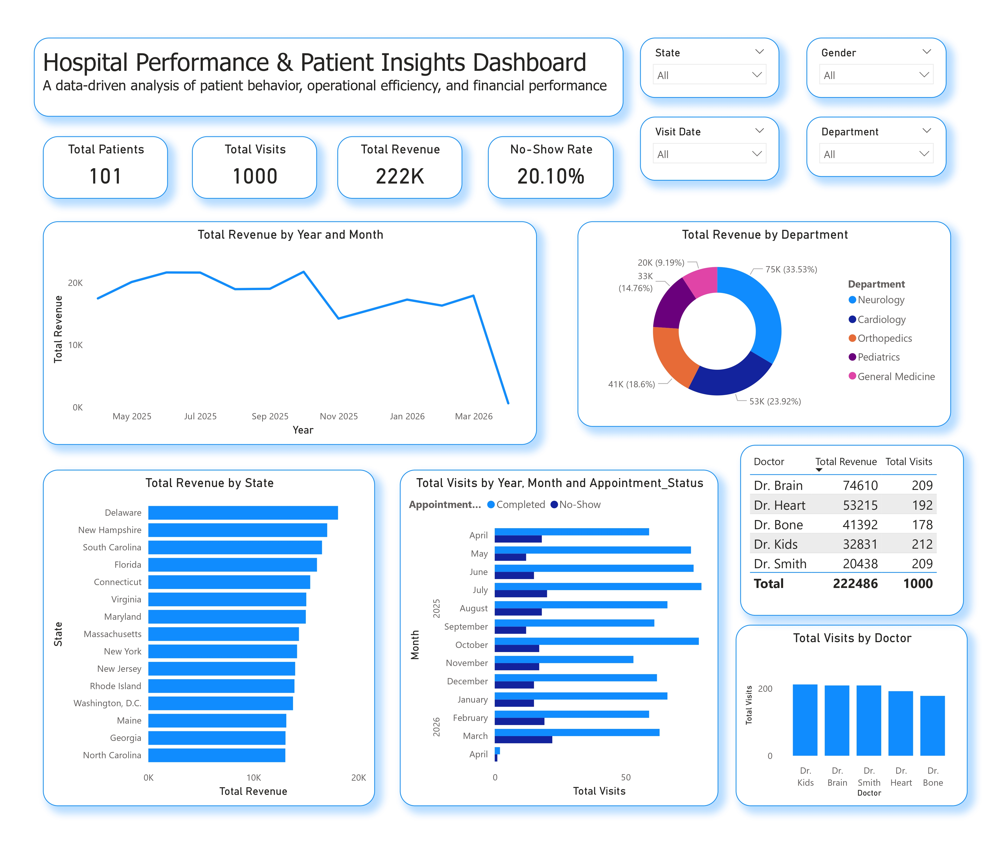

# 🏥 Healthcare Patient Engagement & Revenue Analysis (U.S. State-Based)

## 📌 Project Overview

This project presents an end-to-end healthcare data analysis workflow using **Excel, MySQL, and Power BI**, focusing on patient engagement, revenue performance, and operational insights across **U.S. states**.

The analysis explores how patient behavior, appointment outcomes, and financial performance vary by state, department, and doctor.

---

## 🎯 Objectives

* Analyze **patient engagement and retention**
* Identify **top-performing departments and doctors**
* Evaluate **performance across U.S. states**
* Track **revenue and visit trends over time**

---

## 🛠️ Tools & Technologies

* **Excel** – Data generation, cleaning, and feature engineering
* **MySQL** – Data storage, querying, and analysis
* **Power BI** – Dashboard creation and data visualization

---

## 📊 Dataset Description

The dataset simulates healthcare patient records with the following fields:

* Patient_ID
* Visit_ID
* Full Name
* Gender
* Age
* Age Group
* Department
* Doctor
* Visit_Date
* Month-Year
* State (U.S. State)
* Appointment_Status (Completed / No-show)
* Revenue
* Patient Type (New / Returning)

---

## 🔄 Data Workflow

### 1. Excel

* Generated synthetic healthcare dataset using formulas
* Cleaned and standardized data
* Created derived columns (Age Group, Month-Year, Patient Type)

### 2. MySQL

* Imported dataset into database
* Performed data validation and transformation
* Wrote SQL queries for analysis:

  * Aggregations (SUM, COUNT)
  * Subqueries
  * Window functions (RANK, LAG)

### 3. Power BI

* Connected MySQL database to Power BI
* Built data model and created DAX measures
* Designed an interactive dashboard

---

## 🤖 Use of AI

AI tools were used to assist in:

* Generating and optimizing SQL queries
* Writing advanced functions (RANK, LAG)
* Debugging errors in SQL and DAX
* Structuring calculations for Power BI

All outputs were validated and refined to ensure accuracy and reliability.

---

## 📈 Key Analyses

### 🔹 1. Engagement & Retention Analysis

* Total Patients
* Total Visits
* Returning vs New Patients
* No-show Rate

### 🔹 2. Category Contribution

* Revenue by Department
* Visit distribution by Department

### 🔹 3. State-Level Performance

* Revenue by U.S. State
* No-show trends by state
* Identification of high-performing states

### 🔹 4. Temporal Trend Analysis

* Monthly Revenue Trend
* Monthly Visit Trend
* Growth patterns over time

---

## 📊 Dashboard Features

* KPI Cards (Total Patients, Revenue, Visits, No-show Rate)
* Line Chart (Monthly Revenue Trend)
* Donut Chart (Department Contribution)
* Bar Chart (Revenue by State)
* Stacked Column Chart (Appointment Status Trends)
* Doctor Performance Chart (Top 5 Doctors)
* Interactive slicers (State, Department, Gender, Date)

---

## 🔍 Key Insights

* Revenue demonstrates a consistent upward trend over time
* Certain departments contribute a majority of total revenue
* Patient retention is observed through repeat visits
* No-show rates vary across U.S. states
* Top-performing doctors generate a significant portion of revenue
* State-level differences highlight opportunities for operational improvement

---

## 📁 Project Structure

```
/data        → Excel dataset  
/sql         → MySQL queries  
/dashboard   → Power BI (.pbix file)  
/images      → Dashboard screenshots  
```

---

## 📸 Dashboard Preview



---

## 🚀 How to Use

1. Open the Excel dataset and review the data
2. Import data into MySQL
3. Run SQL queries for analysis
4. Connect MySQL to Power BI
5. Build and interact with the dashboard

---

## 💡 Skills Demonstrated

* Data Cleaning & Preparation
* SQL Querying (Aggregations, Subqueries, Window Functions)
* Data Modeling in Power BI
* DAX Calculations
* Data Visualization & Storytelling

---

## 🔮 Future Improvements

* Add predictive analytics (forecasting trends)
* Include patient diagnosis and treatment data
* Implement cohort-based retention analysis

---

## 👤 Author

Adriane Clark Ballesteros

* 🔗 GitHub: https://github.com/acbshields12

---
